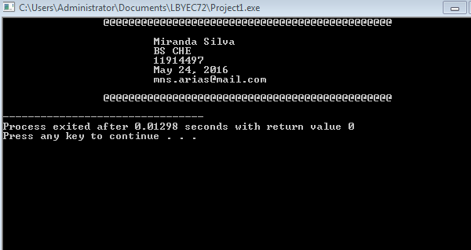

# HellofromMirandaSilva

Hello world repo!

```
#include <stdio.h>
#include <stdlib.h>
int main();
	printf("\t\t@@@@@@@@@@@@@@@@@@@@@@@@@@@@@@@@@@@@@@@@@@@@@@\n\n");
	printf("\t\t\tMiranda Silva\n");
	printf("\t\t\tBS CHE\n");
	printf("\t\t\t11914497\n");
	printf("\t\t\tMay 24, 2016\n");
	printf("\t\t\tmns.arias@mail.com\n\n");
	printf("\t\t@@@@@@@@@@@@@@@@@@@@@@@@@@@@@@@@@@@@@@@@@@@@@@\n");
	return 0;
}
```



